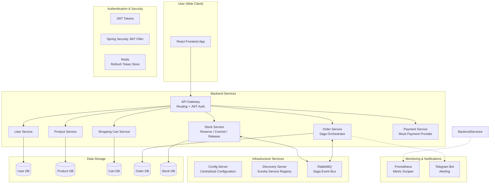

# n11-clone: Mikroservis Tabanlı E-Ticaret Backend Mimarisi

Bu proje, n11 & Patika.dev Java Spring Bootcamp kapsamında geliştirilmiş; modern mikroservis mimarisi, dağıtık sistem prensipleri ve yüksek gözlemlenebilirlik (observability) standartlarını temel alan bir e-ticaret backend uygulamasıdır.

## 🚀 Öne Çıkan Özellikler

- **Mikroservis Mimarisi:** Spring Cloud ve Docker kullanılarak bağımsız ölçeklenebilir servis yapısı.
- **Dağıtık Transaction (Saga Pattern):** Sipariş ve stok yönetimi süreçlerinde veriden tutarlılık için RabbitMQ tabanlı *Choreography-based Saga* mekanizması.
- **Merkezi Kimlik Doğrulama:** API Gateway üzerinden JWT (JSON Web Token) tabanlı güvenlik ve Redis ile yönetilen Refresh Token yapısı.
- **Gözlemlenebilirlik & Monitoring:** Micrometer, Prometheus ve Grafana entegrasyonu ile sistem sağlığı ve metrik takibi.
- **Merkezi Konfigürasyon:** Spring Cloud Config Server ile tüm servislerin ayarlarının tek bir merkezden yönetimi.
- **Otomatik Hata Bildirimi:** Kritik sistem hatalarının ve iptal edilen siparişlerin Telegram Bot API üzerinden anlık bildirimi.
- **AOP Tabanlı Merkezi Loglama:** Aspect Oriented Programming kullanılarak tüm servislerde standart ve temiz hata loglama.

## 🏗️ Mimari Şema



## 🛠️ Teknoloji Yığını

- **Dil:** Java 21
- **Framework:** Spring Boot 3.5, Spring Cloud 2025
- **Güvenlik:** Spring Security, JWT, Redis
- **Mesajlaşma:** RabbitMQ (Saga Flow)
- **Veritabanı:** PostgreSQL (Persistence), Redis (Caching/Token)
- **Monitoring:** Spring Actuator, Micrometer, Prometheus
- **Konteynerizasyon:** Docker, Docker Compose, Google Jib
- **Dokümantasyon:** SpringDoc OpenAPI (Swagger)

## 📦 Servis Envanteri

| Servis | Port | Görev |
| :--- | :---: | :--- |
| **Config Server** | 8762 | Merkezi yapılandırma yönetimi |
| **Discovery Server** | 8761 | Eureka Service Registry |
| **API Gateway** | 8763 | Yönlendirme, JWT Doğrulama, Swagger Aggregation |
| **User Service** | 8764 | Kullanıcı yönetimi, Authentication, Profil |
| **Product Service** | 8765 | Ürün kataloğu ve kategori yönetimi |
| **Shopping Cart** | 8768 | Kullanıcı sepet işlemleri ve Redis entegrasyonu |
| **Order Service** | 8767 | Sipariş yönetimi ve Saga akış yöneticisi |
| **Stock Service** | 8769 | Stok rezervasyon, commit ve release işlemleri |
| **Payment Service** | 8766 | Mock ödeme sağlayıcısı ve doğrulama |
| **Prometheus** | 9090 | Metrik toplama ve izleme arayüzü |

## 🚀 Hızlı Başlangıç

### Ön Gereksinimler
- Docker & Docker Compose
- Java 21+ & Maven

### Kurulum ve Çalıştırma

1. Projeyi klonlayın:
```bash
git clone https://github.com/mrbllyy/n11-clone.git
cd n11-clone
```

2. Tüm servisleri build edin (Jib ile Docker imajları oluşturulur):
```bash
mvn clean compile jib:dockerBuild -DskipTests
```

3. Docker Compose ile tüm stack'i ayağa kaldırın:
```bash
docker compose up -d
```

### Erişim Noktaları
- **Frontend Repository:** [n11-clone-react](https://github.com/mrbllyy/n11-clone-react)
- **Gateway / API:** `http://localhost:8763`
- **Swagger UI:** `http://localhost:8763/swagger-ui.html` (Tüm mikroservis dökümanlarını içerir)
- **Eureka Dashboard:** `http://localhost:8761`
- **Prometheus:** `http://localhost:9090`

## 🔄 Dağıtık İşlem Akışı (Saga Pattern)

1. `order-service` yeni bir sipariş alır, durumu `CREATED` yapar ve `StockReserveRequestedEvent` yayınlar.
2. `stock-service` ilgili ürünleri rezerve eder:
   - Başarılıysa: `StockReservedEvent` yayınlar.
   - Başarısızsa (stok yetersiz): `StockRejectedEvent` yayınlar.
3. `order-service` stok durumuna göre aksiyon alır:
   - Stok onaylandıysa: Ödeme isteği atar (`payment-service`).
   - Ödeme başarılıysa sipariş `COMPLETED` olur, stoklar `commit` edilir.
   - Ödeme başarısızsa sipariş `CANCELLED` olur, stoklar `release` edilir.
4. Herhangi bir hata durumunda (Stok veya Ödeme reddi) Telegram üzerinden sistem yöneticisine anlık bildirim gönderilir.

## 📝 Lisans
Bu proje Patika.dev & n11 bootcamp eğitimi kapsamında geliştirilmiştir.
